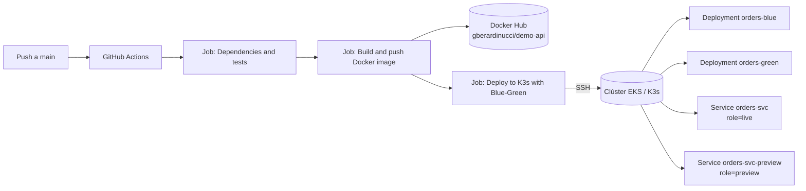

# TechMarket · Orders Service — Pipeline CI/CD Blue-Green sobre Kubernetes (EKS/K3s)

Repositorio del microservicio crítico **"Orders"**, correspondiente a la fase de *Robustecimiento* de la Evaluación Final Transversal (EFT) de la asignatura **AUY1104 – Ciclo de Vida del Software II**.

Este proyecto transforma un despliegue original de tipo `RollingUpdate` sin validaciones —que provocaba caídas de servicio— en un pipeline de CI/CD robusto, con una estrategia de despliegue **Blue-Green** y **remediación automática (rollback)** ante fallos.

## Repositorios relacionados

| Repositorio | Contenido |
|---|---|
| [`AAU1104-GiancarloBerardinucci-Client`](https://github.com/Giancarlo-Berardinucci/AAU1104-GiancarloBerardinucci-Client) | Código del microservicio, workflows de GitHub Actions, manifiestos de Kubernetes |
| [`AAU1104-GiancarloBerardinucci-Shared`](https://github.com/Giancarlo-Berardinucci/AAU1104-GiancarloBerardinucci-Shared) | Plantillas reutilizables (*reusable workflows*) diseñadas en la EP1, consumidas por el repositorio Client |

## Índice

- [Arquitectura general](#arquitectura-general)
- [Estructura del repositorio](#estructura-del-repositorio)
- [Pipeline de CI/CD](#pipeline-de-cicd)
- [Estrategia de despliegue Blue-Green](#estrategia-de-despliegue-blue-green)
- [Remediación automática (rollback)](#remediación-automática-rollback)
- [Secretos y variables de entorno](#secretos-y-variables-de-entorno)
- [Cómo probarlo](#cómo-probarlo)
- [Comandos útiles de verificación](#comandos-útiles-de-verificación)

## Arquitectura general



- **Cómputo:** clúster de Kubernetes (EKS en el escenario productivo; validado en local sobre un nodo K3s control-plane en una instancia EC2).
- **Registro de imágenes:** Docker Hub (`gberardinucci/demo-api`).
- **Orquestador de CI/CD:** GitHub Actions, con jobs reutilizables consumidos desde el repositorio `Shared`.
- **Namespace de trabajo:** `orders`.
- **Conectividad al clúster:** acceso por SSH con llave privada almacenada como secreto del repositorio, usada para ejecutar `kubectl` de forma remota durante el despliegue.

## Estructura del repositorio

```
.
├── .github/
│   └── workflows/
│       ├── ci.yaml              # Orquesta test -> build -> deploy, llamando a los workflows reutilizables
│       └── deploy-blue-green.yaml
├── k8s/
│   ├── deployment-blue.yaml
│   ├── deployment-green.yaml
│   ├── service-live.yaml        # orders-svc (role=live)
│   └── service-preview.yaml     # orders-svc-preview (role=preview)
├── src/                         # Código fuente del microservicio "Orders"
├── Dockerfile
└── README.md
```

## Pipeline de CI/CD

El workflow principal se ejecuta en 3 etapas encadenadas, cada una implementada como *reusable workflow* del repositorio `Shared`:

1. **Dependencies and tests** — instala dependencias y ejecuta las pruebas del microservicio.
2. **Build and push Docker image** — construye la imagen Docker y la publica en Docker Hub (`gberardinucci/demo-api`), etiquetada por commit.
3. **Deploy to K3s with Blue-Green** — aplica los manifiestos en el clúster y ejecuta la estrategia Blue-Green descrita abajo.

Cada etapa recibe variables de entorno dinámicas (nombre de imagen, tag, namespace, credenciales) como *inputs*, lo que permite reutilizar el mismo workflow en distintos entornos sin modificar código.

**Pasos del job de despliegue** (visibles en la ejecución del workflow en Actions):

1. Load SSH key
2. Check SSH access
3. Checkout Kubernetes manifests
4. Select inactive Blue-Green slot
5. Render Kubernetes manifests
6. Apply candidate deployment and preview service
7. Wait for candidate rollout
8. Validate preview health
9. Promote candidate to live traffic
10. Validate live health after promotion
11. **Automatic rollback on failure**
12. Show final Kubernetes state

## Estrategia de despliegue Blue-Green

En el namespace `orders` conviven dos *Deployments*: `orders-blue` y `orders-green`. En todo momento uno de los dos está sirviendo tráfico real y el otro queda disponible como respaldo o como destino de la próxima versión candidata.

El tráfico se controla mediante dos `Services` de Kubernetes:

| Service | Rol | Función |
|---|---|---|
| `orders-svc` | `role=live` | Recibe el tráfico de producción. Su `selector.version` apunta a `blue` o `green` según cuál esté activo. |
| `orders-svc-preview` | `role=preview` | Expone la versión candidata **antes** de recibir tráfico real, para poder validarla de forma aislada. |

**Flujo de una promoción:**

1. El pipeline detecta cuál slot está inactivo (por ejemplo, `blue` está en vivo → el candidato se despliega en `green`).
2. Se aplica el `Deployment` de la versión candidata y se expone únicamente a través de `orders-svc-preview`.
3. Se espera el rollout completo (`kubectl rollout status`) y se ejecuta un **health check** (`GET /health`) contra el servicio de *preview*.
4. Si la validación es exitosa, el pipeline **promueve el tráfico**: actualiza el `selector.version` de `orders-svc` para que apunte al slot candidato (ej. `green`).
5. Se vuelve a validar la salud, ahora sobre el servicio en vivo, para confirmar que el corte de tráfico no introdujo errores.
6. El slot anterior (`blue`) **no se elimina**: queda desplegado y disponible como respaldo inmediato ante un rollback.

Esto permite pasar de una versión a otra sin downtime y sin exponer tráfico real a una versión que aún no ha sido validada.

## Remediación automática (rollback)

Si la etapa de "Validación de Salud" (antes o después de promover el tráfico) detecta un fallo —error HTTP 5xx, timeout o latencia anómala—, el paso **Automatic rollback on failure** del workflow revierte automáticamente el `selector.version` del servicio `orders-svc` hacia la versión estable anterior, sin necesidad de intervención manual.

Como la versión anterior nunca se apaga durante el proceso de promoción, el rollback consiste únicamente en volver a apuntar el selector del `Service`, lo que restablece el tráfico hacia la versión sana en segundos.

Este mecanismo es el que se ejercita en la "Prueba de Fuego": ante un error inyectado en tiempo real durante la defensa, el sistema debe detectar el fallo mediante el health check y auto-recuperarse revirtiendo al slot estable.

## Secretos y variables de entorno

Configurados como *Repository secrets* en GitHub Actions (Settings → Secrets and variables → Actions), nunca expuestos en el código:

- `AWS_ACCESS_KEY_ID`
- `AWS_SECRET_ACCESS_KEY`
- `AWS_SESSION_TOKEN`
- `DOCKER_USERNAME`
- `DOCKER_PASSWORD`
- `EA2_SSH_PRIVATE_KEY` (llave privada para conexión SSH al clúster)

Estos valores se inyectan como variables de entorno dinámicas en tiempo de ejecución del pipeline, permitiendo que el mismo workflow funcione en distintos clústeres/entornos sin cambios en el código.

## Cómo probarlo

```bash
# Verificar el estado del clúster
kubectl get nodes -o wide

# Ver el estado actual de los deployments, pods y servicios
kubectl get deploy,pods,svc -n orders --show-labels

# Ver a qué versión apunta actualmente el tráfico en vivo
kubectl get svc orders-svc -n orders -o jsonpath='{.spec.selector}'; echo

# Probar el health check del servicio en vivo (puerto NodePort expuesto, ej. 30090)
curl -i http://127.0.0.1:30090/health
```

## Comandos útiles de verificación

```bash
# Ver todos los pods con su versión (blue/green)
kubectl get pods -n orders -L version

# Ver los servicios live y preview
kubectl get svc -n orders

# Forzar un rollback manual (equivalente a lo que hace el paso automático)
kubectl patch svc orders-svc -n orders -p '{"spec":{"selector":{"app":"orders","version":"blue"}}}'
```

---

**Aporte al negocio:** esta arquitectura reduce el tiempo de despliegue y el riesgo de caídas del servicio "Orders", ya que cada nueva versión se valida de forma aislada antes de recibir tráfico real, y cualquier fallo posterior a la promoción se corrige automáticamente en segundos, sin intervención manual ni ventanas de mantenimiento.
